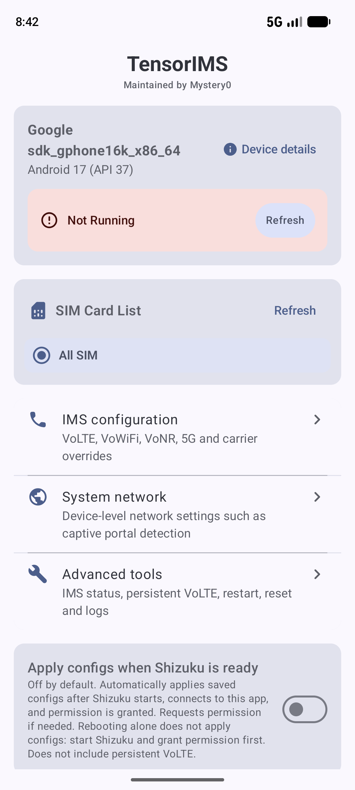
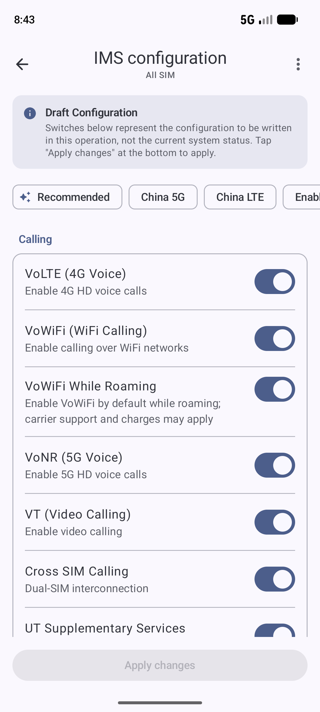
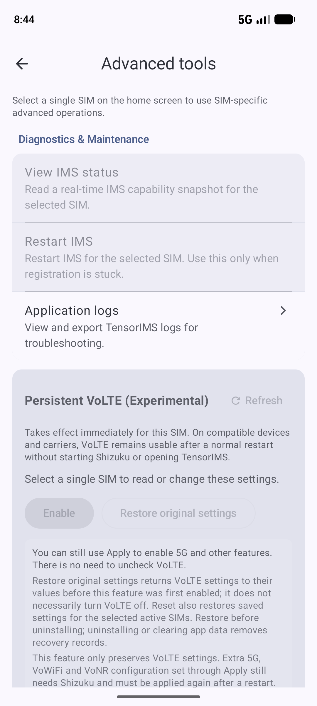

# TensorIMS

> **聚焦中国大陆运营商网络下的 Google Pixel IMS 配置，由 Mystery00 独立维护。**
> 原 **Mystery00/TurboIMS**，现更名为 **TensorIMS**。仅支持搭载 Google Tensor 芯片的 Pixel 设备，需 Android 13+ 和 Shizuku。
>
> 主要适配和维护范围为中国移动、中国联通、中国电信网络下的使用场景。其他运营商因缺少相应设备、SIM 卡及网络测试条件，不作为主要适配和维护对象；这不表示其他网络一定无法使用，实际兼容性需自行验证。

[下载最新版](https://github.com/Pixel-Tailor-CN/TensorIMS/releases/latest) · [项目主页](https://pixel.mystery0.app) · [中文使用说明](README_CN.md) · [问题反馈](https://github.com/Pixel-Tailor-CN/TensorIMS/issues)

  

  <strong>Enable VoLTE, VoWiFi, and other IMS features on Google Pixel devices.</strong>

    
    
    

[简体中文](README_CN.md)

## Screenshots

  
  
  

## About

TensorIMS is a tool that allows you to enable or disable IMS features like Voice over LTE (VoLTE), Wi-Fi Calling (VoWiFi), Video Calling (VT), and 5G Voice (VoNR) on Google Pixel phones. It requires [Shizuku](https://shizuku.rikka.app/) to work.

## Features

- **System Information**: Displays your device's app version, Android version, and security patch version.
- **Shizuku Status**: Shows the current Shizuku status and exposes permission actions when needed.
- **Logcat Viewer**: View and export application logs for debugging purposes.
- **SIM Card Selection**: Apply settings to a specific SIM card or all SIM cards at once.
- **Settings Center**: Separates IMS configuration, device-level system network settings, and advanced tools so new features do not keep expanding one long page.
- **Customizable IMS Features**:
    - **Carrier Name**: Override the carrier name displayed on your device.
    - **IMS User Agent**: Override the IMS User Agent string.
    - **VoLTE (Voice over LTE)**: Enable high-definition voice calls over 4G.
    - **VoWiFi (Wi-Fi Calling)**: Make calls over Wi-Fi networks, with options for Wi-Fi only mode.
    - **VT (Video Calling)**: Enable IMS-based video calls.
    - **VoNR (Voice over 5G)**: Enable high-definition voice calls over 5G (Requires Android 14+).
    - **Cross-SIM Calling**: Enable dual-SIM interconnection features.
    - **UT (Supplementary Services)**: Enable call forwarding, call waiting, and other supplementary services over UT.
    - **5G NR**: Enable 5G NSA (Non-Standalone) and SA (Standalone) networks.
    - **5G Signal Strength Thresholds**: Option to apply custom 5G signal strength thresholds.
    - **5G+/5GA Icon**: Configure the carrier thresholds used by Android to expose the enhanced 5G icon.
    - **Enhanced 4G LTE (LTE+)**: Enable the system carrier configuration used for LTE+/4G+ support.
    - **Hide Enhanced Data Icon**: Optionally hide the LTE+/4G+ data icon; actual LTE+/4G+ availability still depends on the device, carrier, and current network.
    - **Show 4G for LTE**: Display the 4G label for LTE data.
- **System Network / Captive Portal**: Read, override, or remove the SettingsProvider values for Android's `captive_portal_http_url` and `captive_portal_https_url`.
- **Persistent VoLTE (Experimental)**: Keep the dedicated VoLTE opt-in/user setting path separate from temporary CarrierConfig drafts.
- **Configuration Persistence**: Automatically saves configuration per SIM card.

> **Captive Portal limitation:** TensorIMS verifies the values written to SettingsProvider, but some Android/NetworkStack builds may prefer resource overlays over those values. A successful write therefore does **not** prove that the active network probe URL changed. Reconnect the network and verify behavior on the target device.

> **Note:** Country ISO customization has been removed from TensorIMS. If you need this feature, please use [carrier-ims-for-pixel](https://github.com/ryfineZ/carrier-ims-for-pixel).

## Requirements

- **Supported Devices**: Google Pixel devices with Google Tensor chips.
    - Pixel 6, 6 Pro, 6a
    - Pixel 7, 7 Pro, 7a
    - Pixel 8, 8 Pro, 8a
    - Pixel 9, 9 Pro, 9 Pro XL, 9 Pro Fold, 9a
    - Pixel 10, 10 Pro, 10 Pro XL, 10 Pro Fold, 10a
    - Pixel 11, 11 Pro, 11 Pro XL, 11 Pro Fold
    - Pixel Fold, Pixel Tablet
    - **Note:** Devices with Qualcomm Snapdragons (Pixel 5 and older) are NOT supported.
- Android 13 or higher
- [Shizuku](https://shizuku.rikka.app/) installed and running

## Installation

1. Download the latest APK from the [Releases](https://github.com/Pixel-Tailor-CN/TensorIMS/releases) page.
2. Install the APK on your device.
3. Open the app and grant Shizuku permission.

## Usage

1. **Check Status**: Ensure Shizuku is running and the app has permission.
2. **Select SIM**: Choose the SIM card you want to configure on the home screen.
3. **IMS Configuration**: Open **IMS configuration**, edit the desired feature draft, then tap **Apply changes**.
4. **System Network**: Open **System network** for device-level settings such as Captive Portal. These settings are not tied to the selected SIM.
5. **Advanced Tools**: Use the advanced page for IMS status, persistent VoLTE, IMS restart/reset, and logs.

## About this Project

This project originated as a fork of [Turbo1123/TurboIMS](https://github.com/Turbo1123/TurboIMS). However, due to various stability issues encountered during usage, the codebase has undergone a complete refactoring. This includes rewriting the core logic for SIM card reading and carrier configuration, as well as redesigning the UI and icons.

本项目此前以 **Mystery00/TurboIMS** 的名称发布，现以 **TensorIMS** 继续独立维护，后续不计划合并上游代码。更名仅针对本维护版本；GitHub 上保留原有 fork 关系及来源说明。

应用包名与签名配置保持不变，已安装本维护版本的用户可通过相同签名的新版本覆盖升级。使用 Obtainium 的用户可将来源更新为本仓库；如设置了 APK 文件名过滤条件，请同步调整为 TensorIMS。

## Credits

- **[vvb2060/Ims](https://github.com/vvb2060/Ims)**
- **[nullbytepl/CarrierVanityName](https://github.com/nullbytepl/CarrierVanityName)**: Carrier name modification logic is derived from this project.
- **[kyujin-cho/pixel-volte-patch](https://github.com/kyujin-cho/pixel-volte-patch)**
- The app icon is based on an original design from [iconfont](https://www.iconfont.cn/collections/detail?cid=28924), modified for use in this project.

## Disclaimer

This application modifies your device's carrier configuration and, when requested, selected device-level network settings. Use it at your own risk. The developers are not responsible for any damage or loss of functionality.

## License

This project is licensed under the Apache License 2.0. See the [LICENSE](LICENSE) file for details.
