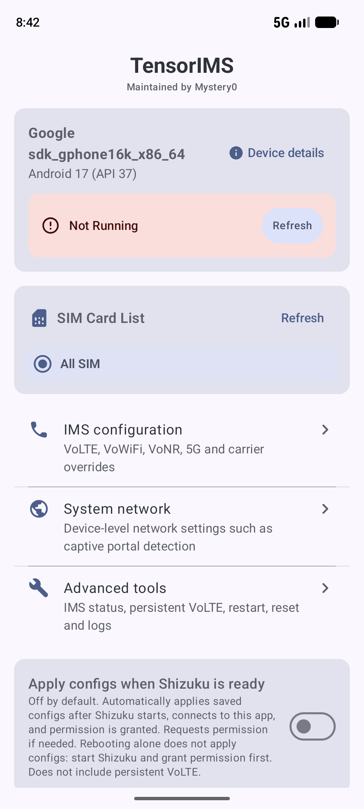
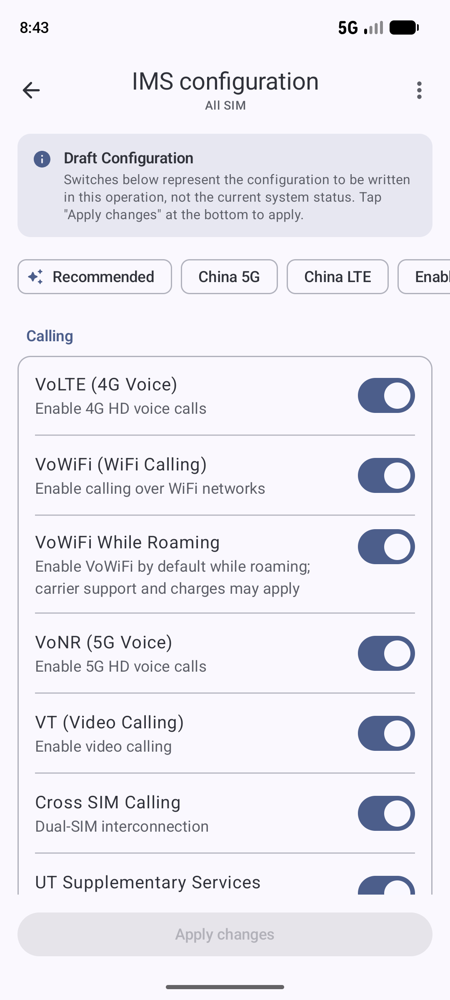
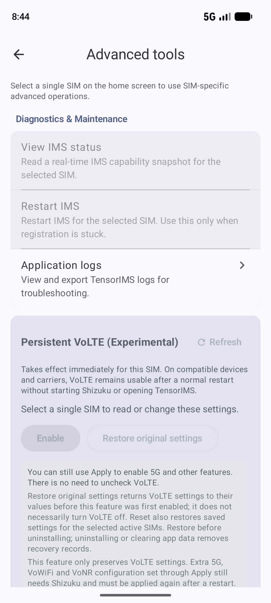

# TensorIMS

## 双模式开发分支说明

已知能力边界：当前接口不能独立证明 CarrierConfig 覆盖删除完成。重置会实际请求并回读，但显示「已请求、尚未确认」，保留恢复保护和自动恢复暂停；全卡重置可能在首卡未确认后停止。它不能被当作已完整成功的重置功能。

本分支提供两个 flavor，每个 APK 都完整包含官方 Shizuku 和私有内置两种模式，不按后端拆包：

- `tensor`：`app.mystery0.ims.tensor`，与旧版独立安装，私有数据独立且不自动迁移
- `legacy`：`io.github.vvb2060.ims`，仅在签名与原安装一致且 `versionCode` 更高时可覆盖升级，保留原有配置、自动恢复数据和私有持久化 VoLTE 原值备份

两个 flavor 共用 `app.mystery0.ims.tensor` namespace 和第一方代码。桌面上旧包显示为“TensorIMS（旧包名）”（英文为“TensorIMS (Legacy)”），日志头包含 applicationId/flavor，便于核对当前版本。首次使用均需显式选择后端；内置通过各自独立无线 ADB 配对或用户批准的已有 root 启动，不管理其他 Shizuku 客户端。模式可在设置页切换；写入或恢复未结束时禁止切换。

本分支尚未通过真实 Pixel 的双包安装/覆盖升级、私有桥接、双服务共存或 IMS 通信验收；下方历史截图及现有 Release 下载不代表本分支已经发布或验证。设备支持清单沿用上游范围，不等于本次已验证。请先阅读 [真机验收与迁移](docs/implementation/DEVICE_ACCEPTANCE.md)。换用 `tensor` 前，先关闭旧版自动恢复并恢复旧版持久化 VoLTE 原值，不要先卸载旧版或清理其数据。两包不可同时启用自动恢复修改同一 SIM；独立安装不代表 Android 全局 shell 委托可并行使用。

本地构建需要 JDK 21、SDK 37：

```sh
./gradlew :app:testTensorDebugUnitTest :app:testLegacyDebugUnitTest
./gradlew :app:assembleTensorDebug :app:assembleLegacyDebug
./gradlew :app:lintTensorDebug :app:lintLegacyDebug
# release 构建必须完整提供现有四项 SIGN_KEY_* 配置
./gradlew :app:assembleTensorRelease :app:assembleLegacyRelease
```

debug 自动使用标准开发签名；release 缺少完整签名配置时明确失败，不能回退到 debug 签名。正式发布和 master 预发布均约定在同一 Release 提供两个同版本 APK 及各自 mapping，沿用既有签名 Secrets；master 仍以提交信息包含 `ci` 为门禁。产物按 `TensorIMS-<applicationId>-<versionName>.apk` 和 `TensorIMS-<applicationId>-<versionName>-mapping.txt` 区分。共用 CI 签名配置不等于已核实旧安装证书，不能据此保证覆盖升级。详见[双包发布补充设计](docs/plans/2026-10-02-dual-package-release-design.md)。


> **聚焦中国大陆运营商网络下的 Google Pixel IMS 配置，由 Mystery00 独立维护。**
> 原 **Mystery00/TurboIMS**，现更名为 **TensorIMS**。仅支持搭载 Google Tensor 芯片的 Pixel 设备，需 Android 13+，并通过明确选择的后端取得特权。
>
> 主要适配和维护范围为中国移动、中国联通、中国电信网络下的使用场景。其他运营商因缺少相应设备、SIM 卡及网络测试条件，不作为主要适配和维护对象；这不表示其他网络一定无法使用，实际兼容性需自行验证。

[下载最新版](https://github.com/Pixel-Tailor-CN/TensorIMS/releases/latest) · [项目主页](https://pixel.mystery0.app) · [中文使用说明](README_CN.md) · [问题反馈](https://github.com/Pixel-Tailor-CN/TensorIMS/issues)

<p align="center">
  
</p>

<p align="center">
  <strong>Enable VoLTE, VoWiFi, and other IMS features on Google Pixel devices.</strong>
</p>

<p align="center">
    <a href="https://github.com/Pixel-Tailor-CN/TensorIMS/releases"></a>
    <a href="LICENSE"></a>
    <a href="https://apps.obtainium.imranr.dev/redirect.html?r=obtainium://add/https://github.com/Pixel-Tailor-CN/TensorIMS"></a>
</p>

[简体中文](README_CN.md)

## Screenshots

<p align="center">
  
  
  
</p>

## About

TensorIMS is a tool that allows you to enable or disable IMS features like Voice over LTE (VoLTE), Wi-Fi Calling (VoWiFi), Video Calling (VT), and 5G Voice (VoNR) on Google Pixel phones. Official mode uses [Shizuku](https://shizuku.rikka.app/); embedded mode requires independent wireless ADB pairing or existing root approval.

## Features

- **Structured Information Architecture**:
    - **Home Screen**: Overview of device and selected backend status, SIM selector, navigation to core modules, and the toggle for "Apply configs when the backend is ready".
    - **IMS Configuration**: Draft mode configuration organized into "Calling", "Network", "Display", and "Advanced Overrides", with one-tap quick presets and manual fine-tuning.
    - **System Network**: Dedicated device-level system network settings, offering Captive Portal probe endpoint configuration with popular presets.
    - **Advanced Tools**: Segregated into "Diagnostics & Maintenance" (IMS status snapshot, restart IMS, application logs) and "Danger Zone" (reset CarrierConfig overrides), alongside Persistent VoLTE management.
- **One-Tap Quick Presets**:
    - **Recommended**: Enables essential 4G/5G calling and network capabilities (VoLTE, VoNR, 5G NR, 5G signal threshold alignment, VT) while keeping VoWiFi disabled.
    - **China 5G**: Full 5G experience for Chinese mainland carriers with VoNR, 5GA/5G+ icon, and 5G signal threshold alignment.
    - **China LTE**: Pure 4G mode with 5G NR & VoNR explicitly disabled for stable cellular connectivity, battery saving, and thermal reduction.
    - **Enable all**: Enables all available toggleable features at once.
- **Automation & Persistence**:
    - **Apply configs when the backend is ready**: Automatically restores saved configurations when the device reboots and the selected backend is ready and authorized.
    - **Persistent VoLTE (Experimental)**: Leverages system-level VoIMS opt-in to keep VoLTE active across device reboots without needing Shizuku on every restart.
    - **Configuration Persistence**: Automatically saves configuration history per SIM card or for all SIMs.
- **Customizable IMS Features**:
    - **Carrier Name**: Override the carrier name displayed on your device.
    - **IMS User Agent**: Override the IMS User Agent string.
    - **VoLTE (Voice over LTE)**: Enable high-definition voice calls over 4G.
    - **VoWiFi (Wi-Fi Calling)**: Make calls over Wi-Fi networks, with options for Wi-Fi only mode.
    - **VT (Video Calling)**: Enable IMS-based video calls.
    - **VoNR (Voice over 5G)**: Enable high-definition voice calls over 5G (Requires Android 14+).
    - **Cross-SIM Calling**: Enable dual-SIM interconnection features.
    - **UT (Supplementary Services)**: Enable call forwarding, call waiting, and other supplementary services over UT.
    - **5G NR**: Enable 5G NSA (Non-Standalone) and SA (Standalone) networks.
    - **5G Signal Strength Thresholds**: Option to apply custom 5G signal strength thresholds.
    - **5G+/5GA Icon**: Configure the carrier thresholds used by Android to expose the enhanced 5G icon.
    - **Enhanced 4G LTE (LTE+)**: Enable the system carrier configuration used for LTE+/4G+ support.
    - **Hide Enhanced Data Icon**: Optionally hide the LTE+/4G+ data icon; actual LTE+/4G+ availability still depends on the device, carrier, and current network.
    - **Show 4G for LTE**: Display the 4G label for LTE data.
- **System Network / Captive Portal**: Read, override, or remove SettingsProvider values for Android's `captive_portal_http_url` and `captive_portal_https_url`, with built-in presets (Google, V2EX, Xiaomi, vivo, Huawei).
- **Logcat Viewer**: View and export application logs for troubleshooting.

> **Captive Portal limitation:** TensorIMS verifies the values written to SettingsProvider, but some Android/NetworkStack builds may prefer resource overlays over those values. A successful write therefore does **not** prove that the active network probe URL changed. Reconnect the network and verify behavior on the target device.

## Requirements

- **Supported Devices**: Google Pixel devices with Google Tensor chips.
    - Pixel 6, 6 Pro, 6a
    - Pixel 7, 7 Pro, 7a
    - Pixel 8, 8 Pro, 8a
    - Pixel 9, 9 Pro, 9 Pro XL, 9 Pro Fold, 9a
    - Pixel 10, 10 Pro, 10 Pro XL, 10 Pro Fold, 10a
    - Pixel 11, 11 Pro, 11 Pro XL, 11 Pro Fold
    - Pixel Fold, Pixel Tablet
    - **Note:** Devices with Qualcomm Snapdragons (Pixel 5 and older) are NOT supported.
- Android 13 or higher
- Official mode: [Shizuku](https://shizuku.rikka.app/) installed, running and authorized; embedded mode: explicit wireless ADB pairing or existing root approval

## Installation

<a href="https://apps.obtainium.imranr.dev/redirect.html?r=obtainium://add/https://github.com/Pixel-Tailor-CN/TensorIMS"></a>

1. Choose the APK by application ID on the [Releases](https://github.com/Pixel-Tailor-CN/TensorIMS/releases) page: `app.mystery0.ims.tensor` for a separate installation, or `io.github.vvb2060.ims` to keep the old application identity. Both include official and embedded modes.
2. Follow the [installation and data-safety checklist](docs/implementation/DEVICE_ACCEPTANCE.md#安装前), including signature and version checks. Do not uninstall the old app just to work around a signature mismatch.
3. Open the app, explicitly choose a mode and authorize/start that backend; complete read-only device acceptance first.

## Usage

1. **Check Status**: Ensure the selected backend is running and authorized.
2. **Select SIM**: Choose the single SIM card or "All SIM" to configure on the home screen.
3. **IMS Configuration**: Open **IMS configuration**, pick a quick preset ("Recommended", "China 5G", or "China LTE") or adjust switches by category, then tap **Apply changes**.
4. **Auto-Restore (Optional)**: Enable "Apply configs when the backend is ready" on the home screen to automatically restore configurations after reboots once the selected backend is ready.
5. **System Network**: Open **System network** to manage Captive Portal detection URLs with one-tap presets; changes apply globally across the device.
6. **Advanced Tools**: Use the advanced page to inspect real-time IMS capability snapshots, restart IMS if needed, or reset CarrierConfig overrides in the Danger Zone.

## About this Project

This project originated as a fork of [Turbo1123/TurboIMS](https://github.com/Turbo1123/TurboIMS). However, due to various stability issues encountered during usage, the codebase has undergone a complete refactoring. This includes rewriting the core logic for SIM card reading and carrier configuration, as well as redesigning the UI and icons.

本项目此前以 **Mystery00/TurboIMS** 的名称发布，现以 **TensorIMS** 继续独立维护，后续不计划合并上游代码。更名仅针对本维护版本；GitHub 上保留原有 fork 关系及来源说明。

本双模式分支同时提供新包 `app.mystery0.ims.tensor` 与兼容旧应用身份的 `io.github.vvb2060.ims`，每包均含两个后端。新包不覆盖旧包，也不自动迁移私有数据；旧包 flavor 的覆盖升级仍须满足原安装签名一致且 `versionCode` 更高。请按[真机验收与迁移](docs/implementation/DEVICE_ACCEPTANCE.md)选择安装路径，并核对 Releases/Obtainium 实际下载的 applicationId、版本和证书。

## Credits

- **[vvb2060/Ims](https://github.com/vvb2060/Ims)**
- **[nullbytepl/CarrierVanityName](https://github.com/nullbytepl/CarrierVanityName)**: Carrier name modification logic is derived from this project.
- **[kyujin-cho/pixel-volte-patch](https://github.com/kyujin-cho/pixel-volte-patch)**
- The app icon is based on an original design from [iconfont](https://www.iconfont.cn/collections/detail?cid=28924), modified for use in this project.

## Disclaimer

This application modifies your device's carrier configuration and, when requested, selected device-level network settings. Use it at your own risk. The developers are not responsible for any damage or loss of functionality.

## License

This project is licensed under the Apache License 2.0. See the [LICENSE](LICENSE) file for details.

### 应用语言

点击首页右上角齿轮进入“应用设置”，可选择“自动（跟随系统）”、English 或简体中文。默认使用自动，更改立即生效并由 Android 系统保存，与系统应用语言设置同步。新增翻译需添加相应 `values-<语言限定符>/strings.xml` 并更新 `app/src/main/res/xml/locales_config.xml`；选择器自动读取该列表，缺失文案回退到默认英语资源。
