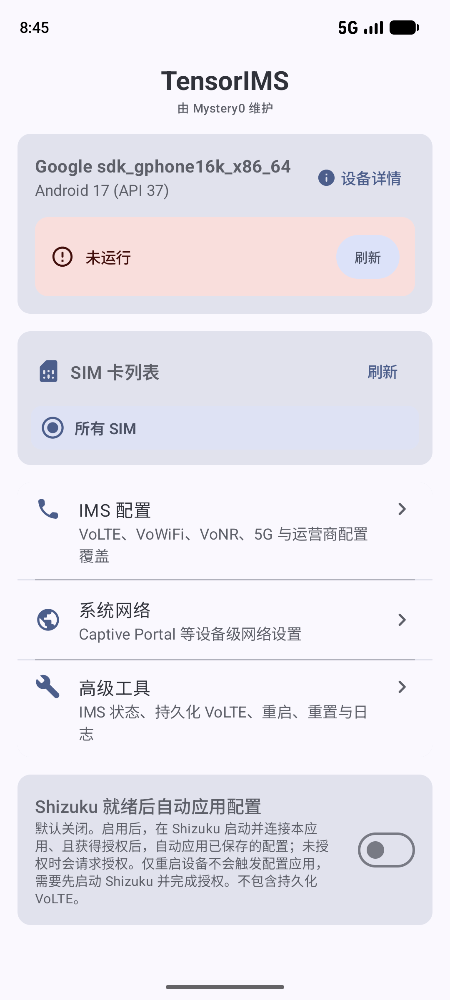
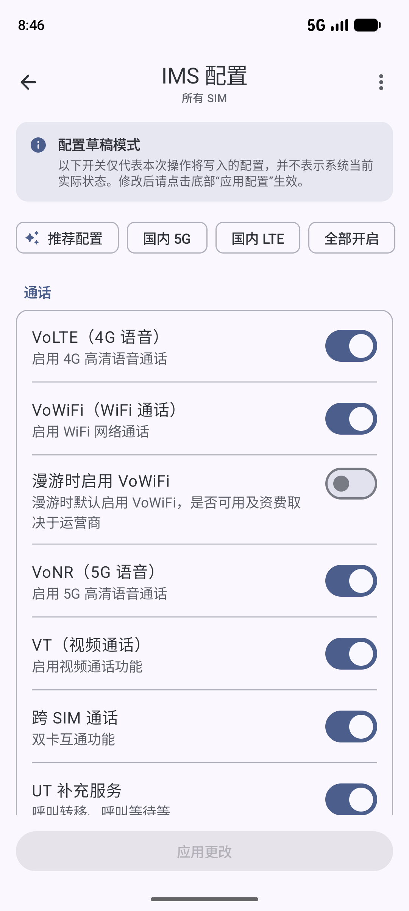
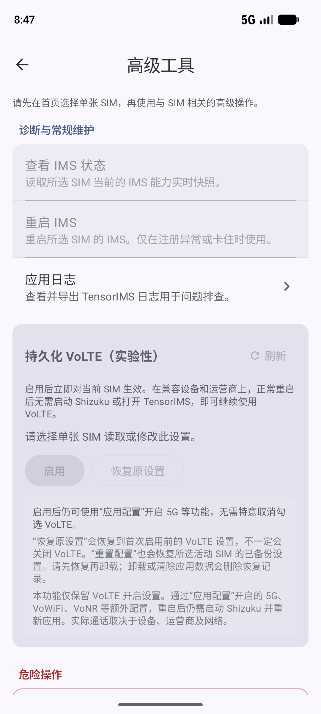

# TensorIMS

## 双模式开发分支说明

已知能力边界：当前接口不能独立证明 CarrierConfig 覆盖删除完成。重置会实际请求并回读，但显示「已请求、尚未确认」，保留恢复保护和自动恢复暂停；全卡重置可能在首卡未确认后停止。它不能被当作已完整成功的重置功能。

本分支提供两个 flavor，每个 APK 都完整包含官方 Shizuku 和私有内置两种模式，不按后端拆包：

- `tensor`：`app.mystery0.ims.tensor`，与旧版独立安装，私有数据独立且不自动迁移
- `legacy`：`io.github.vvb2060.ims`，仅在签名与原安装一致且 `versionCode` 更高时可覆盖升级，保留原有配置、自动恢复数据和私有持久化 VoLTE 原值备份

两个 flavor 共用 `app.mystery0.ims.tensor` namespace 和第一方代码。桌面上旧包显示为“TensorIMS（旧包名）”（英文为“TensorIMS (Legacy)”），日志头包含 applicationId/flavor，便于核对当前版本。首次使用均需显式选择后端；内置通过各自独立无线 ADB 配对或用户批准的已有 root 启动，不管理其他 Shizuku 客户端。模式可在设置页切换；写入或恢复未结束时禁止切换。

本分支尚未通过真实 Pixel 的双包安装/覆盖升级、私有桥接、双服务共存或 IMS 通信验收；下方历史截图及现有 Release 下载不代表本分支已经发布或验证。设备支持清单沿用上游范围，不等于本次已验证。请先阅读 [真机验收与迁移](docs/implementation/DEVICE_ACCEPTANCE.md)。换用 `tensor` 前，先关闭旧版自动恢复并恢复旧版持久化 VoLTE 原值，不要先卸载旧版或清理其数据。两包不可同时启用自动恢复修改同一 SIM；独立安装不代表 Android 全局 shell 委托可并行使用。

本地构建需要 JDK 21、SDK 37：

```sh
./gradlew :app:testTensorDebugUnitTest :app:testLegacyDebugUnitTest
./gradlew :app:assembleTensorDebug :app:assembleLegacyDebug
./gradlew :app:lintTensorDebug :app:lintLegacyDebug
# release 构建必须完整提供现有四项 SIGN_KEY_* 配置
./gradlew :app:assembleTensorRelease :app:assembleLegacyRelease
```

debug 自动使用标准开发签名；release 缺少完整签名配置时明确失败，不能回退到 debug 签名。正式发布和 master 预发布均约定在同一 Release 提供两个同版本 APK 及各自 mapping，沿用既有签名 Secrets；master 仍以提交信息包含 `ci` 为门禁。产物按 `TensorIMS-<applicationId>-<versionName>.apk` 和 `TensorIMS-<applicationId>-<versionName>-mapping.txt` 区分。共用 CI 签名配置不等于已核实旧安装证书，不能据此保证覆盖升级。详见[双包发布补充设计](docs/plans/2026-10-02-dual-package-release-design.md)。


> **聚焦中国大陆运营商网络下的 Google Pixel IMS 配置，由 Mystery00 独立维护。**
> 原 **Mystery00/TurboIMS**，现更名为 **TensorIMS**。仅支持搭载 Google Tensor 芯片的 Pixel 设备，需 Android 13+，并通过明确选择的后端取得特权。
>
> 主要适配和维护范围为中国移动、中国联通、中国电信网络下的使用场景。其他运营商因缺少相应设备、SIM 卡及网络测试条件，不作为主要适配和维护对象；这不表示其他网络一定无法使用，实际兼容性需自行验证。

[下载最新版](https://github.com/Pixel-Tailor-CN/TensorIMS/releases/latest) · [项目主页](https://pixel.mystery0.app) · [使用说明](#使用) · [问题反馈](https://github.com/Pixel-Tailor-CN/TensorIMS/issues)

<p align="center">
  
</p>

<p align="center">
  <strong>在 Google Pixel 设备上开启 VoLTE、VoWiFi 和其他 IMS 功能。</strong>
</p>

<p align="center">
    <a href="https://github.com/Pixel-Tailor-CN/TensorIMS/releases"></a>
    <a href="LICENSE"></a>
    <a href="https://apps.obtainium.imranr.dev/redirect.html?r=obtainium://add/https://github.com/Pixel-Tailor-CN/TensorIMS"></a>
</p>

[English](README.md)

## 截图

<p align="center">
  
  
  
</p>

## 关于

TensorIMS 是一个允许您在 Google Pixel 手机上启用或禁用 VoLTE（高清语音通话）、VoWiFi（Wi-Fi 通话）、VT（视频通话）和 VoNR（5G 语音）等 IMS 功能的工具。官方模式需要 [Shizuku](https://shizuku.rikka.app/zh-CN/)；内置模式需要独立无线 ADB 配对或已有 root。选择模式本身不代表已经获得权限。

## 功能

- **清晰的分层信息架构**：
    - **首页**：集中展示设备与 Shizuku 状态、SIM 卡选择、功能入口导航，以及“后端就绪后自动应用配置”开关。
    - **IMS 配置**：采用草稿模式设计，按“通话 / 网络 / 显示 / 高级覆盖”清晰分组管理，支持一键快速预设与按需微调。
    - **系统网络**：独立管理设备级系统网络设置，提供 Captive Portal 探测地址配置及国内常用预设快捷填入。
    - **高级工具**：区分“诊断与常规维护”（实时 IMS 状态、重启 IMS、应用日志）与“危险操作”（重置 CarrierConfig 覆盖），并承载持久化 VoLTE 管理。
- **一键快速配置预设**：
    - **推荐配置**：开启 4G/5G 核心通话与网络能力（VoLTE、VoNR、5G NR、5G 信号门限对齐、VT），默认关闭国内卡暂不支持的 VoWiFi。
    - **国内 5G**：一键开启国内三大运营商 5G 完整网络体验，包含 VoNR、5GA/5G+ 图标与 5G 信号门限对齐。
    - **国内 LTE**：纯净 4G 模式，显式关闭 5G NR 与 VoNR，专注网络稳定、省电抗发热及长续航。
    - **全部开启**：一键开启全部可用功能开关。
- **自动化与持久化**：
    - **Shizuku 就绪后自动应用**：可选择在设备重启且当前选定后端启动授权后自动恢复上次成功应用的配置，无需每次开机手动操作。
    - **持久化 VoLTE（实验性）**：使用系统底层 VoIMS opt-in 接口，启用后正常重启设备无需依赖 Shizuku 即可保持 VoLTE 生效。
    - **配置持久化**：按 SIM 卡（或全部卡）自动保存配置历史。
- **可定制的 IMS 功能**：
    - **运营商名称**：覆盖设备上显示的运营商名称。
    - **IMS User Agent**：自定义 IMS User Agent 字符串。
    - **VoLTE（高清语音通话）**：开启 4G 高清语音通话。
    - **VoWiFi（Wi-Fi 通话）**：通过 Wi-Fi 网络拨打电话。
    - **漫游 VoWiFi**：可选择漫游时默认启用 VoWiFi。
    - **VT（视频通话）**：开启基于 IMS 的视频通话。
    - **VoNR（5G 语音）**：开启 5G 高清语音通话（需要 Android 14+）。
    - **Cross-SIM Calling（跨卡通话）**：开启双卡互连功能。
    - **UT（补充业务）**：通过 UT 开启呼叫转移、呼叫等待等补充服务。
    - **5G NR**：开启 5G NSA（非独立组网）和 SA（独立组网）网络。
    - **5G 信号强度阈值**：可选择是否应用自定义的 5G 信号强度阈值。
    - **5G+/5GA 图标**：配置 Android 显示增强 5G 图标时使用的运营商阈值。
    - **Enhanced 4G LTE（LTE+）**：开启系统用于 LTE+/4G+ 的增强型 4G LTE 配置。
    - **隐藏增强型数据图标**：可选择隐藏 LTE+/4G+ 数据图标；实际 LTE+/4G+ 可用性仍取决于设备、运营商和当前网络。
    - **LTE 显示为 4G**：将 LTE 数据网络显示为 4G 图标。
- **系统网络 / Captive Portal**：读取、覆盖或移除 Android `captive_portal_http_url` 与 `captive_portal_https_url` 的 SettingsProvider 值，内置 Google 官方、V2EX、小米、vivo、华为等快捷填入预设。
- **Logcat 查看器**：实时查看和一键导出应用日志以排查问题。

> **Captive Portal 限制：** TensorIMS 可以确认写入 SettingsProvider 的值，但部分 Android/NetworkStack 版本可能优先使用资源 overlay，因此“写入成功”并不等于当前网络探测一定已经改用新地址。修改后请重新连接网络，并在目标设备上验证实际行为。

## 要求

- **支持设备**：搭载 Google Tensor 芯片的 Pixel 设备。
    - Pixel 6, 6 Pro, 6a
    - Pixel 7, 7 Pro, 7a
    - Pixel 8, 8 Pro, 8a
    - Pixel 9, 9 Pro, 9 Pro XL, 9 Pro Fold, 9a
    - Pixel 10, 10 Pro, 10 Pro XL, 10 Pro Fold, 10a
    - Pixel 11, 11 Pro, 11 Pro XL, 11 Pro Fold
    - Pixel Fold, Pixel Tablet
    - **注意：** 搭载 Qualcomm Snapdragon 芯片的设备（Pixel 5 及更早机型）**不支持**。
- Android 13 或更高版本
- 官方模式：已安装并运行 [Shizuku](https://shizuku.rikka.app/zh-CN/) 并授权；内置模式：由用户手动开启无线调试并独立配对，或批准已有 root

## 安装

<a href="https://apps.obtainium.imranr.dev/redirect.html?r=obtainium://add/https://github.com/Pixel-Tailor-CN/TensorIMS"></a>

1. 从 [Releases](https://github.com/Pixel-Tailor-CN/TensorIMS/releases) 选择包名对应的 APK：新装独立应用选 `app.mystery0.ims.tensor`；保留旧应用身份选 `io.github.vvb2060.ims`。两包功能相同，均可选择官方或内置模式。
2. 按[安装前检查](docs/implementation/DEVICE_ACCEPTANCE.md#安装前)核对签名、版本及数据保护步骤后安装；不要为解决签名不匹配而先卸载旧版。
3. 打开应用，明确选择模式并完成该模式的授权/手动启动；先执行只读验收。

## 使用

1. **检查状态**：确保当前选定后端显示就绪且应用已获得权限。
2. **选择 SIM 卡**：在首页选择要配置的单张 SIM 卡或“所有 SIM”。
3. **IMS 配置**：进入“IMS 配置”，可直接使用“推荐配置”、“国内 5G”或“国内 LTE”快捷预设，亦可按分组手动微调开关，点击底部“应用更改”生效。
4. **自动恢复（可选）**：在首页开启“后端就绪后自动应用配置”，设备重启且当前选定后端启动授权后将自动恢复已保存的配置。
5. **系统网络**：进入“系统网络”管理 Captive Portal 联网探测地址，可一键选择国内节点预设；该设置作用于全局设备，不随 SIM 切换。
6. **高级工具**：进入“高级工具”可查看当前 SIM 的实时 IMS 能力快照、卡死时重启 IMS，或在“危险操作”区重置配置覆盖。

## 项目说明

本项目最初 fork 自 [Turbo1123/TurboIMS](https://github.com/Turbo1123/TurboIMS)。在使用原项目的过程中，由于遇到诸多问题，我决定对整个代码库进行彻底重构。这包括重写 SIM 卡读取、运营商配置的核心逻辑，以及重新设计 UI 和图标。

本项目此前以 **Mystery00/TurboIMS** 的名称发布，现以 **TensorIMS** 继续独立维护，后续不计划合并上游代码。更名仅针对本维护版本；GitHub 上保留原有 fork 关系及来源说明。

本双模式分支同时提供新包 `app.mystery0.ims.tensor` 与兼容旧应用身份的 `io.github.vvb2060.ims`，每包均含两个后端。新包不覆盖旧包，也不自动迁移私有数据；旧包 flavor 的覆盖升级仍须满足原安装签名一致且 `versionCode` 更高。请按[真机验收与迁移](docs/implementation/DEVICE_ACCEPTANCE.md)选择安装路径，并核对 Releases/Obtainium 实际下载的 applicationId、版本和证书。

## 鸣谢

- **[vvb2060/Ims](https://github.com/vvb2060/Ims)**
- **[nullbytepl/CarrierVanityName](https://github.com/nullbytepl/CarrierVanityName)**：运营商名称修改功能的代码参考自此项目。
- **[kyujin-cho/pixel-volte-patch](https://github.com/kyujin-cho/pixel-volte-patch)**
- App 图标源于 [iconfont](https://www.iconfont.cn/collections/detail?cid=28924) 平台的设计，并在此基础上进行了修改以适配本项目。

## 免责声明

本应用会修改设备的运营商配置，并在用户主动操作时修改部分设备级网络设置。请自行承担使用风险。开发者对任何功能损坏或损失概不负责。

## 许可证

本项目使用 Apache License 2.0 许可证。有关详细信息，请参阅 [LICENSE](LICENSE) 文件。
