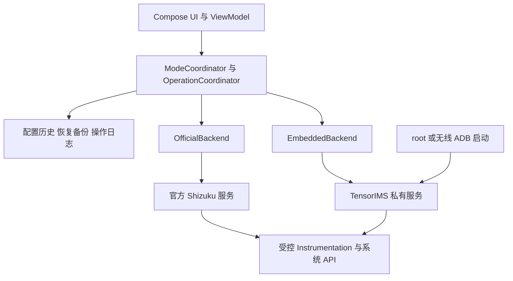
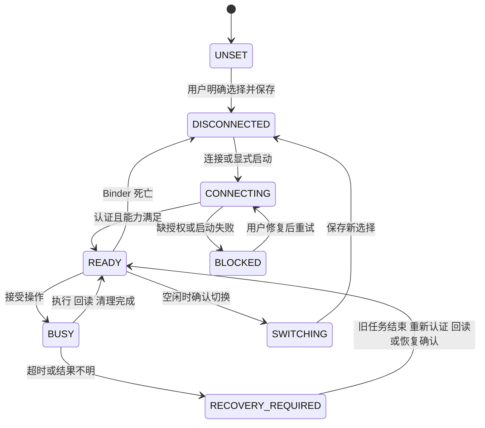

# TensorIMS 单 APK 双模式工程设计

设计评审稿 · 2026 年 10 月 1 日 · v0.1

本文是待评审设计，不是实施授权。Word 与 Markdown 由同一内容源生成。

## 1 设计结论与范围

本方案以一个全新应用承载两种特权后端：首次启动由用户明确选择官方 Shizuku 或内置 Shizuku，之后在设置中切换。applicationId、namespace 和全部第一方代码包统一为 app.mystery0.ims.tensor。发布一个 release APK，不拆分外置版与内置版，不保留旧包名构建。

推荐把内置模式实现为仅服务 TensorIMS 的精简私有桥接层，复用必要的 Shizuku 启动与兼容代码；官方模式保留官方客户端协议。两者共用业务逻辑、配置历史和恢复数据，通过同一调度器串行执行。

### 已确认的产品边界

- 应用名称暂用“TensorIMS 双模式版”作为文档工作名称；最终展示名尚未确定，新包名已确定。

- 内置模式只提供 TensorIMS 所需能力，不提供其他应用授权管理、通用 Binder 代理、rish 或任意命令执行界面。

- 官方 Shizuku 可继续安装和服务其他应用。新应用不停止、重启、清理或接管官方服务；共存不等于所有特权操作能够并发执行。

- 首次选择可以取消或返回。未选择时保持未配置状态，不启动特权服务，不执行写入，也不自动选中检测到的服务。

### 文档状态与成功标准

这是待评审的工程设计草案，不代表功能已经实现，也不授权后续实施。成功标准是：两个模式业务结果一致；切换不丢配置、不抢占另一套服务；失败可解释、可恢复；真实 Pixel 上通过双服务共存与 IMS 回归验证。

| 证据类别 | 截至 2026 年 10 月 1 日的结论 |
| --- | --- |
| 源码基线 | TensorIMS 9441fcc4；Shizuku b844bc49；Shizuku API a27f6e41。完整版本与链接见第 12 节。 |
| 现有构建 | 原始 debug 构建因缺少签名环境变量失败；外部初始化脚本仅取消 debug 签名后，可生成未签名 APK，36 项单元测试通过。 |
| 尚未验证 | 本方案未写产品代码；未验证模拟器、真机 IMS、私有桥接、双服务共存、切换和 release 体积。 |

维护范围沿用现有项目：Google Pixel Tensor、Android 13 及以上，重点覆盖中国移动、中国联通、中国电信。系统版本或运营商差异不能仅凭编译通过认定兼容。[S1–S3]

## 2 架构选择与组件边界

| 方案 | 收益与代价 | 结论 |
| --- | --- | --- |
| 精简私有桥接 | 面向少量明确操作；生命周期、授权和 IPC 可独立；需要编写窄接口并验证隐藏 API。 | 推荐 |
| 完整改名移植 Shizuku | 可复用较完整管理端与服务端；需持续隔离客户端扫描、授权数据库、启动器、服务名和升级逻辑，维护面更大。 | 保留为原型失败后的重新评审选项 |
| 直接内嵌官方服务原样启动 | 初期修改少；可能扫描官方客户端、共享状态或触发官方进程清理，无法满足共存边界。 | 不采用 |

图 1 业务层只依赖统一后端接口 两套 Binder 保持分离

ModeCoordinator 管理选择、连接和会话代际；OperationCoordinator 统一排队、禁止危险切换并汇总逐卡结果。ConfigurationRepository 继续负责历史和自动恢复语义，不感知后端实现。

OfficialBackend 封装官方 Binder、授权状态和版本检查。EmbeddedBackend 封装自有启动器、握手和窄 AIDL；EmbeddedServer 只接受本应用的固定操作。PrivilegeSession 将模式、operationId 与会话 Binder 传入 Instrumentation，避免它重新读取全局默认后端。

官方 API 的静态 Binder 只属于官方适配器。私有 Binder 不送入 Shizuku.onBinderReceived 一类全局入口；即使内置模式收到官方广播，也不能触发业务执行或改变当前模式。

## 3 操作契约与数据流

现有依赖不止首页状态检查：ShizukuProvider 使用 ShizukuBinderWrapper 启动 Instrumentation，PrivilegedOperation 用它建立权限委托，部分入口直接调用 phone／subscription 服务。重构必须覆盖这些路径，而不是只替换一个连接按钮。[S2–S4]

### 统一契约

PrivilegeBackend 对业务层提供状态流、连接、断开和执行能力；请求携带 protocolVersion、operationId、sessionEpoch、固定 operationType、目标 subId 与 SIM 身份摘要。响应包含逐卡结果、实际回读、错误码及恢复要求。版本不兼容或能力缺失时拒绝执行，不按默认成功处理。

| 业务能力 | 现有入口及拟议窄操作 | 必须保持的结果语义 |
| --- | --- | --- |
| SIM 与 IMS 读取 | SimReader、ImsCapabilityReader、ImsConfigurationReader；readSims／readCapabilities／readConfig | 权限失败和缺键表示未知；不得转换成全部关闭。 |
| CarrierConfig 写入与重置 | ImsModifier、BrokerInstrumentation；applyConfig／resetConfig | 只写用户明确目标；按卡身份校验、有限回读后保存成功历史。 |
| IMS 重启 | ImsResetter；resetIms | 仅允许项目所需的 phone／subscription 调用；返回明确完成状态。 |
| 持久化 VoLTE | PersistentVolteModifier；readPersistentVolte／setPersistentVolte／restorePersistentVolte | 先落原值备份；失败尽力回滚；未知结果先核对，不能盲目重试。 |
| Captive Portal | CaptivePortalSettingsModifier；read／write／resetCaptivePortal | 两个键成组；失败尽力恢复；回读成功不等于实际探测地址生效。 |

### 内置服务的最小特权面

服务端只接受操作枚举，不接受任意组件名、包名、shell 命令、原始 transaction code 或可任意转发的 Binder。它在内部将操作映射到固定 Instrumentation，固定目标包为本应用，并建立带期限的一次性会话。

Instrumentation 经会话调用 beginDelegation／endDelegation 和少量明确的 telephony 方法；服务端校验该会话的 operationId、目标 UID、方法集合与有效期。官方实现沿用受控 Shizuku 包装路径。参数限制、返回类型和 Android 版本差异统一封装，禁止业务类继续直接读取 Shizuku 单例。权限委托应按操作收敛到所需集合，现有 null 全权限委托的替代范围需原型验证。

执行顺序为：检查当前后端与授权 → 获得操作锁 → 再次校验 SIM 身份与会话 → 建立恢复记录 → 执行及回读 → 保存成功历史 → 清理委托与会话 → 返回 UI。Broker fallback 仍在同一后端、同一操作锁内，只用于现有允许的权限／空结果情形，绝不切换模式。

## 4 模式状态机与切换事务

持久化 chosenMode 只有 UNSET、OFFICIAL、EMBEDDED，并带设置 schema 版本。运行态 connectionState、授权结果、Binder、PID 和 sessionEpoch 全部重建；保存过“已连接”不能作为下次启动的事实。

图 2 选定模式与连接状态独立 失败后保留用户选择

| 事件 | 确定行为 |
| --- | --- |
| 空闲时切换 | 冻结新请求，取得同一操作锁，递增 epoch，取消尚未执行的读取和自动恢复，解绑旧后端；持久化新选择，再连接新后端。 |
| 正在写入或恢复 | 拒绝本次切换并说明“操作完成后再切换”；不自动排一个可能被遗忘的切换。可取消尚未启动的任务，不能强杀已执行的持久化写入。 |
| 新后端连接失败 | 保留用户选定的新模式，显示修复／重试入口；不悄悄恢复旧模式，不自动改走另一个后端。 |
| 旋转 屏幕返回 进程重建 | 草稿与选择按各自生命周期恢复；连接重新握手。迟到回调必须匹配 epoch 和 operationId。 |
| 结果未知或清理失败 | 进入 RECOVERY_REQUIRED，阻止新写入与模式切换，先核对系统值及旧任务终态；不得把客户端超时当成服务已停止。 |

从内置切到官方时，建议停止空闲且已认证为本实例所有的内置服务。停止未确认则显示残留状态，并等待服务租约到期；不得用“shizuku”进程名批量杀进程。官方后端的断开只释放客户端引用，绝不停止官方服务。

## 5 IPC 认证与安全边界

### 独立命名与发现

官方客户端 Provider 保持 ${applicationId}.shizuku 的协议约定；私有接收端使用 app.mystery0.ims.tensor.embedded.bridge，私有 AIDL 位于 app.mystery0.ims.tensor.bridge。进程名、临时文件、锁、日志标签和握手方法单独命名，绝不读写官方 shizuku.json 或注册官方客户端扫描逻辑。[S5–S6]

默认使用定向 Provider 握手向本应用交付 Binder，不向其他应用广播。私有启动接收端若需 exported，必须逐次检查真实 Binder 调用 UID 为预期 shell／root，并校验本次启动挑战；普通 UI 组件不暴露启动或授予权限的 intent。单独的 signature 权限不能作为 shell／root bootstrap 的唯一门槛，因为该身份通常不持有应用自定义签名权限。

### 每次请求都验证调用者

- 服务端先读取 Binder.getCallingUid，再进行身份切换；要求等于当前 Android 用户下本应用的已安装 UID。不要信任 Bundle 声明的 uid、package 或 pid。首版不声明 sharedUserId。

- 由 PackageManager 核对 UID 对应包、预期包名及受信任签名证书／合法签名轮换链。证书锚点来自构建与安装身份，不接受调用者临时传入的任意证书作为信任根。

- 握手返回协议版本、构建标识、运行 UID、能力集及新鲜会话挑战。应用只接纳当前启动尝试对应的会话；旧 Binder、重放消息、不同用户和版本不匹配均拒绝。

- 业务调用仍需 operationId、会话期限、方法白名单与参数边界；拒绝未选内置模式或会话已撤销的调用。PID 只用于诊断和进程实例核验，不能单独作为授权依据。

### 凭据与威胁模型

无线 ADB 使用本应用独立配对身份。私钥不导出、不记录日志；若 ADB 实现支持不可导出 Keystore 密钥则直接使用，否则用 Keystore 密钥加密私有存储中的密钥材料，并验证库接口兼容性。配对码只短暂驻留内存；撤销配对或密钥失效后要求用户重新配对。不得复制官方 Shizuku 的密钥、授权或设置。

以上边界用于防止普通第三方应用调用特权服务及误连另一套服务。两个以 shell UID 运行的进程仍共享系统身份，不构成对恶意 shell 的安全隔离；已取得 root 的对手也不在隔离承诺内。随机挑战和私有名字有助于防误接与重放，但不能把同 UID 进程变成彼此不可信的安全域。

日志保留模式、脱敏操作 ID、协议版本、错误码和耗时，不写配对码、私钥、完整 SIM 标识或全量 Binder 参数。异常导出前给用户预览与脱敏机会。

## 6 启动方式与服务生命周期

| 模式与启动 | 用户前提 | 重启及失效后的行为 |
| --- | --- | --- |
| 官方 Shizuku | 用户已安装并启动官方应用，向本应用授予官方 API 权限。 | 重新等待官方服务和授权；无权限时只提示官方授权，不启动内置作为替代。 |
| 内置 无线 ADB | Android 13+ 目标范围内，由用户开启无线调试并在本应用完成独立配对；本应用连接该设备的 ADB。 | 设备重启后服务不保证存活。根据无线调试、配对状态和用户启动意愿重新建立；配对被撤销时重新配对。 |
| 内置 root | 设备已有可用 root，用户批准本应用的提权请求；只启动本应用服务。 | 首版建议手动启动。开机启动仅在另行显式启用后考虑，仍需验证系统及 root 管理器约束。 |

### 从 APK 到服务

启动器每次由 PackageManager 解析当前安装 APK 路径，校验包和版本，加载随同一 APK 分发的服务代码与 arm64 原生资源。启动失败必须显示具体阶段：配对、ADB 连接、提权、加载、握手或能力检查。不得硬编码 /data/app 的随机目录，也不复用官方管理端 APK 路径。

会话持有应用 Binder 的死亡监听，并为断联后的空闲服务设置有界租约。运行中的操作优先完成回读和清理，再结束服务；租约不是在写入中途强杀的计时器。应用更新后使旧协议会话失效，等待旧任务清理，再以新 APK 路径启动新服务。

### 退出与孤儿进程

正常关闭使用已认证 Binder 上的 shutdownOwnedServer；只允许空闲且属于当前安装身份和服务实例的服务退出。必要的恢复入口核对 UID、PID、启动时间、进程命令来源与实例标识，任何一项不能证实就不发送 kill。名称匹配、过期 PID 文件或“它看起来像 Shizuku”都不足以证明所有权。

如果应用被系统杀死，服务尽力清理自己的委托并退出；如果服务突然死亡，应用使会话失效并阻止新写入。两种情况都可能留下结果不明的操作，必须走第 7 节的恢复流程。官方服务死亡只影响官方模式，不触发内置启动。

### 自动恢复与自动启动分开

“后端就绪后自动应用配置”沿用默认关闭、按开机去重、有限重试及用户拒绝后不循环弹窗的原则。它不等于允许自动配对、启动 root、打开无线调试或修改全局 ADB 设置。内置自动启动若未来加入，应单独开关、单独说明前提；首版以显式启动为默认。[S7–S8]

## 7 写入安全与恢复一致性

### 串行边界覆盖全部入口

手动操作、自动恢复、设置切换、Instrumentation fallback 与服务关闭共用调度约束。沿用现有 instrumentationMutex 和“旧 watcher 结束前不启动下一项”的意图，并将其扩展为后端无关的操作状态。当前代码已意识到超时／协程取消并不代表设备端结束，不能在重构时丢失该保护。[S2]

写入开始前持久化最小操作记录：operationId、模式、操作类型、目标 SIM 身份摘要、恢复记录引用及阶段。它不保存敏感凭据，也不替代原值备份。执行结果成功且回读一致后才完成记录；进程重建发现未完成记录时先核对，禁止自动重放可能改变持久化状态的动作。

### 持久化 VoLTE

保留 noBackupFilesDir/persistent_volte_<subId>.json 的原值备份含义，包括原始 -1 与 SIM 身份校验。先可靠写入备份，再修改 VoIMS opt-in 和用户开关；失败时尽力恢复。只要回滚、回读或清理结果仍不明，就保留备份并显示“需要恢复”。切换模式不清理备份，禁用功能也不能把备份视为普通缓存。

恢复态退出要求：确认旧任务和委托已结束（或设备已重启），重新认证当前选定后端并回读。需要回滚时由用户确认执行专门恢复事务；终态确认后回到 READY，否则继续禁止普通写入。

用户取消只影响尚未启动的请求或允许安全终止的只读阶段。已进入持久化写入时，UI 可以离开页面，但后台必须继续到回读和清理；不能因为切换、取消按钮、超时或界面销毁直接杀 Instrumentation。

### 其他业务语义

CarrierConfig 新协议继续保存稀疏明确目标，逐卡回读成功才更新历史；批量部分成功保留未成功目标。重置先处理相应持久化 VoLTE 原值，再清除 CarrierConfig。持久化 VoLTE 与 Captive Portal 均不加入自动恢复配置列表。

自动恢复只对当前已选且 READY 的后端生效。模式变化撤销尚未执行的恢复任务；重新就绪时按已有开机计数、配置 revision 和 SIM 身份去重，不能因为两套服务都发出连接事件而重复写入。

### 系统级并发限制

Android 16 的 AccessCheckDelegateHelper 对 shell 权限委托存在全局单一 Instrumentation 限制。两个独立服务只能避免彼此业务层混用，无法用各自互斥锁消除系统级冲突。遇到其他应用占用时返回 DELEGATION_BUSY，等待其结束后由用户重试；不得停止或清理别人的委托。[S9]

仅在本次确实成功建立委托后执行对应清理，并集中兼容旧无参与新带 UID 的 stopDelegateShellPermissionIdentity。旧接口无法提供强所有权保证，竞态必须纳入真机验证；清理失败进入恢复态，不宣称所有平台都能无冲突并发。[S4]

## 8 新包身份与迁移策略

| 变更范围 | 必要检查 |
| --- | --- |
| 构建与源码 | applicationId、namespace、全部第一方 package／import、源码目录、R／BuildConfig 引用和测试命名空间统一改为 app.mystery0.ims.tensor。 |
| 组件与资源 | Manifest 相对类名、Instrumentation targetPackage、Provider authorities、显式 ComponentName、Intent action、深链与 FileProvider 全量核对。 |
| Native 与压缩 | 检查 JNI 类名／注册表、CMake 路径、反射字符串、R8 keep、入口 main 类、AIDL 描述符和被脚本按字符串加载的类。 |
| 交付链 | CI、ADB 示例、脚本、测试 fixtures、文档、崩溃符号及 release 元数据更新；为新应用确定长期签名证书与版本序列。 |
| 必须保留的上游身份 | 第三方 rikka／moe 库包、Android 隐藏 API stub 包、官方客户端协议权限名按契约保留；不能机械全局替换全部依赖包名。 |

官方 API 的 uses-permission 与“声明一个同名自有权限”是不同动作。作为客户端可使用官方协议要求的权限名；本应用不得重新定义官方管理端权限或复用官方管理端 authority。检查合并后的 Manifest，而非只看源文件。[S3、S5]

### 新应用安装不继承旧数据

io.github.vvb2060.ims 与 app.mystery0.ims.tensor 是两个 Android 应用身份。即使展示名相同或签名相同，也不会自动覆盖升级或共享私有目录。首版不做静默跨包数据迁移，不将 Android 自动备份视为持久化 VoLTE 原值的可靠迁移渠道。

同一新 APK 内切换后端则继续使用同一应用数据目录：历史、草稿、模式设置和恢复备份均保留。模式切换不得触发清空数据、重置 SIM 配置或重新生成原值备份。

### 首版迁移流程

- 在旧版仍可运行时关闭它的自动恢复。记录用户希望保留的配置，并在旧版恢复已修改 SIM 的持久化 VoLTE 原值；暂未激活的 SIM 需重新激活后完成恢复。

- 确认旧版原值恢复完成后安装新版，选择模式，读取设备当前状态，再由用户明确应用目标。新版第一次开启持久化 VoLTE 时重新建立自己的原值备份。

- 新版功能和恢复验证完成之前保留旧版及其数据。卸载旧版会删除其私有恢复依据；“先卸载再迁移”不能作为默认指导。

两版短期共存时禁止同时启用自动恢复，以免反复覆盖配置。将来若要做受控导出／导入，应单独设计版本校验、SIM 身份校验和原值来源证明；本次不承诺一键迁移。[S1、S7]

## 9 用户流程与故障反馈

### 首次启动与设置页

首次显示两个同等明确的选择项。“官方 Shizuku”说明需要外部官方应用及授权；“内置 Shizuku”说明无需外部管理端，但仍需无线 ADB 配对或已有 root。选择确认后进入该模式的连接引导。取消保持未选择，返回后可重新进入，不能边展示选项边启动任何服务。

设置页固定展示当前模式、运行身份 shell／root、连接状态、授权状态和版本。首页显示简洁状态及修复入口，避免把“选择内置”误读成“已经获得特权”。切换确认说明当前操作是否完成、内置服务是否将停止，以及同一应用配置会保留。

| 错误码或情形 | 用户可见信息与下一步 |
| --- | --- |
| MODE_UNSET | 尚未选择运行模式。选择一个模式后再使用特权功能。 |
| OFFICIAL_UNAVAILABLE | 官方 Shizuku 未运行或不可用。打开官方应用完成启动后重试。 |
| PERMISSION_DENIED | 本应用未获官方授权。提供授权入口；拒绝后等待用户主动重试。 |
| PAIRING_REQUIRED／ADB_REVOKED | 本应用尚未配对或配对已撤销。引导独立配对，不读取官方凭据。 |
| AUTH_FAILED／VERSION_MISMATCH | 无法验证服务身份或协议不兼容。阻止业务请求，显示版本与重新启动入口。 |
| DELEGATION_BUSY | 另一项系统特权操作尚未结束。稍后重试，不主动终止其他应用。 |
| OPERATION_INDETERMINATE | 操作结果尚未确认。先刷新并核对状态；存在备份时提供恢复入口。 |
| CLEANUP_FAILED／ORPHANED_SERVICE | 权限清理或私有服务退出未确认。阻止危险后续写入，提供诊断与安全重启指导。 |
| UNSUPPORTED_CAPABILITY | 当前系统或设备不支持该项能力。保留未知状态与明确原因，不显示为已关闭。 |

配对、启动、授权、执行、回读与清理分别显示阶段和超时原因。可重试项应说明重试是否只读；涉及结果未知的写入必须先核对。多 SIM 部分成功按卡显示，不给出误导性的全局“成功”。

选择官方模式但未安装官方应用时保留该选择并给出官方安装说明；官方模式授权被拒绝时也不切换内置。已经使用内置模式且同时安装官方 Shizuku，是允许且需测试的状态。

## 10 验收矩阵与验证证据

发布前至少在一台真实 Pixel Tensor 建立端到端证据，再扩展已声明支持的 Android／设备组合。单元测试验证状态与纯逻辑；模拟器或编译验证不能代替 IMS 注册、通话与运营商行为。

| 验收组 | 关键场景与通过标准 |
| --- | --- |
| 身份与安装 | 新 APK 与官方 Shizuku、旧 TensorIMS 可同时安装；无权限名／authority 冲突；第一方旧包名无运行残留；一个 release 变体包含两个模式。 |
| 共存顺序 | 官方先启动／内置先启动；分别重启两者；官方两个既有客户端持续可用。内置不接收它们请求，也不改变其授权。 |
| 首次选择与切换 | 未选择、返回、取消、重复打开、旋转、后台恢复；空闲双向切换保留数据；写入中切换被拒绝；迟到回调不串模式。 |
| 故障与撤权 | Binder 死亡、官方撤权、ADB 配对密钥撤销、关闭无线调试、root 拒绝、服务版本不匹配；停止在准确状态，无隐藏 fallback。 |
| 更新与重启 | 设备重启、应用更新、APK 安装目录变化、应用进程死亡、服务残留；重新认证、读取当前路径，且不误杀官方服务。 |
| 写入一致性 | CarrierConfig 单卡／全卡及部分失败，SIM 热切换或 subId 复用；持久化 VoLTE 原值含 -1、备份写入失败、回滚失败和超时。 |
| 并发与清理 | 官方第三方客户端同时使用 Instrumentation；本应用手动操作叠加自动恢复；无重复写入、无跨应用清理；冲突有明确信息。 |
| 真实通信 | 目标运营商下分别验证 IMS 注册、VoLTE 呼入呼出、VoWiFi／VoNR 的受支持路径、双 SIM 及恢复；记录系统版本和网络前提。 |

### 分层门槛

第一层是纯逻辑测试：状态转移、epoch 过滤、权限拒绝、串行调度、操作日志与迁移提示。第二层是构建及静态检查：合并 Manifest、R8／JNI 入口、许可文件、签名与单 APK 内容。第三层是真机安全原型：握手、双服务共存、只读调用与权限清理通过后，才进入可恢复写入。

Android 13–16 作为稳定平台候选，Android 17／SDK 37 相关版本单列实验或预览验证；状态须按真实系统构建号填写。无线 ADB 与 root 各跑完整矩阵，不能以其中一种通过替代另一种。未具备测试条件的机型、系统或运营商明确标为未验证。

当前已完成的仅是旧实现基线：JDK 21.0.12.1、Gradle 9.7.1、AGP 9.4.1、SDK 37、默认 Build Tools 36.0.0；签名绕过只作用于外部 debug 初始化；36 测试、6 测试类、0 失败。原始 SIGN_KEY_STORE_FILE 缺失问题、真实设备测试和新设计验证均未被这些结果消除。

## 11 交付阶段与成本边界

### 阶段与停止条件

| 阶段 | 产出与继续条件 |
| --- | --- |
| 设计评审 | 确认本文接口边界、模式语义、恢复策略与验收范围。书面设计获确认后，才能进入单独的实施计划。 |
| 私有桥接原型 | 在真实设备证明独立启动、身份认证、只读调用、Instrumentation 会话传递和清理；两套服务互不接管。任一关键隔离条件失败就停止扩展写功能并修订设计。 |
| 单 APK 与双模式接入 | 完成新应用身份、后端抽象、设置选择与切换、操作恢复；旧业务路径逐项迁入统一契约，按第 10 节验收。 |
| 发布候选 | 带 release 签名与 R8 的真机包完成两模式回归、迁移说明、许可清单和体积对比；保留 mapping 与诊断信息。 |

### 体积与人日估算

现有 TensorIMS 3.8.0 发布 APK 实测 2,843,180 字节，约 2.843 MB；它是体积参考，不是同提交的严格 A/B 基线。精简内置能力初估增加 0.5–1.5 MB，可先预留 2 MB 增量空间。此估算依赖原生配对库、资源保留和 R8 效果，不应拿约 63 MB 的 debug 包推算用户下载体积。

正式测量必须在同一提交、相同 arm64 ABI、相同 release 压缩和签名条件下，对比未引入内置能力的基线与新单 APK，并拆分 dex、native、资源和许可文件。最终交付仍只发布双模式 APK；对比基线仅用于测量。

粗估：私有桥接可行性原型 5–10 人日；桥接达到可发布可靠性约 15–25 人日，通常包含原型阶段；新包身份、模式 UI 与打包整合另计约 3–5 人日。若范围无重叠，整体可先按约 18–30 人日评估。等待设备、运营商验证及未知系统兼容问题不含在承诺内，原型后重估。

### 主要风险与发布措施

| 风险 | 控制措施 |
| --- | --- |
| 隐藏 API 或全局委托改变 | 集中版本适配；按实际 framework 核对接口；冲突可报告，不承诺系统级并发。 |
| 超时后重复写入或恢复依据丢失 | 操作日志、原值备份和回读共同决策；结果未知先恢复，旧版数据不提前删除。 |
| 误认服务或污染官方状态 | UID 与签名验证、分离命名和会话；检查无官方扫描／授权数据库／进程清理路径。 |
| 许可证与品牌混淆 | TensorIMS 与 Shizuku 主仓库为 Apache 2.0，Shizuku API 为 MIT；保留版权、许可及适用 NOTICE，标记修改与来源，不冒称官方。 |

更换包名允许独立安装，但不能保证规避任何检测；官方 Shizuku 若仍安装，其包仍可能被其他应用看到。本文不设计隐藏、规避检测或绕过系统安全的能力。

## 12 待验证项与来源

### 评审后需要实验回答的问题

- 固定操作 AIDL 能否在目标 Android 版本完整覆盖现有 phone／subscription 与 Instrumentation 能力；会话 Binder 传递、NO_RESTART 和委托清理是否保持一致。若不能，先评审增补窄接口，不直接暴露任意 Binder。

- 选定无线 ADB 实现是否支持不可导出 Keystore 签名；如不支持，验证 Keystore 加密存储方案。配对 UI、前后台限制和服务空闲租约的具体时间以真机测量确定。

- 最小发布设备／系统组合、长期签名证书管理和最终展示名需在发布准备阶段落实。root 开机自动启动不属于首版默认行为。上述事项不重新开放已经确定的单 APK、新包名和双模式选择。

### 代码与公开文档

以下源码按列出的提交审阅；链接指向对应文件或版本。第 1、10、11 节的本地构建与体积结论来自本次基线验证记录，不等同于上游的兼容承诺。

- [S1 TensorIMS 项目约定与业务边界](https://github.com/Pixel-Tailor-CN/TensorIMS/blob/9441fcc4e3ae265c8dc82cd88f198f30641ad339/AGENTS.md)
- [S2 TensorIMS ShizukuProvider 启动与串行控制](https://github.com/Pixel-Tailor-CN/TensorIMS/blob/9441fcc4e3ae265c8dc82cd88f198f30641ad339/app/src/main/java/io/github/vvb2060/ims/ShizukuProvider.kt)
- [S3 TensorIMS Manifest 与应用构建](https://github.com/Pixel-Tailor-CN/TensorIMS/tree/9441fcc4e3ae265c8dc82cd88f198f30641ad339/app)
- [S4 TensorIMS 特权入口与委托兼容层](https://github.com/Pixel-Tailor-CN/TensorIMS/tree/9441fcc4e3ae265c8dc82cd88f198f30641ad339/app/src/main/java/io/github/vvb2060/ims/privileged)
- [S5 Shizuku 服务端 客户端扫描与身份处理](https://github.com/RikkaApps/Shizuku/tree/b844bc491f1790c72328e1a8e5b2349f8978f0ea/server/src/main/java/rikka/shizuku/server)
- [S6 Shizuku 启动器与应用路径假设](https://github.com/RikkaApps/Shizuku/tree/b844bc491f1790c72328e1a8e5b2349f8978f0ea/starter)
- [S7 TensorIMS 自动恢复与持久化 VoLTE 设计](https://github.com/Pixel-Tailor-CN/TensorIMS/tree/9441fcc4e3ae265c8dc82cd88f198f30641ad339/docs/plans)
- [S8 Shizuku 官方启动说明](https://shizuku.rikka.app/guide/setup/)
- [S9 AOSP Android 16 AccessCheckDelegateHelper](https://android.googlesource.com/platform/frameworks/base/+/android16-release/services/core/java/com/android/server/am/AccessCheckDelegateHelper.java)
- [S10 Shizuku API 固定版本与 MIT 许可](https://github.com/RikkaApps/Shizuku-API/tree/a27f6e4151ba7b39965ca47edb2bf0aeed7102e5)
- [S11 Shizuku Apache 2.0 许可](https://github.com/RikkaApps/Shizuku/blob/b844bc491f1790c72328e1a8e5b2349f8978f0ea/LICENSE)
- [S12 TensorIMS Apache 2.0 许可](https://github.com/Pixel-Tailor-CN/TensorIMS/blob/9441fcc4e3ae265c8dc82cd88f198f30641ad339/LICENSE)

TensorIMS：9441fcc4e3ae265c8dc82cd88f198f30641ad339
Shizuku：b844bc491f1790c72328e1a8e5b2349f8978f0ea
Shizuku API：a27f6e4151ba7b39965ca47edb2bf0aeed7102e5

评审重点是私有接口是否足够、切换与未知结果是否安全、迁移是否保护原值备份，以及真机验收范围是否现实。本文确认后再另行编写实施计划。
